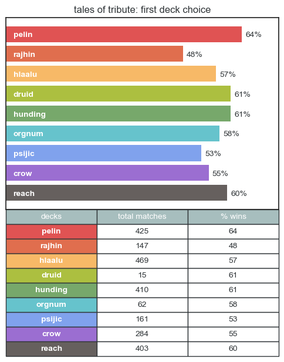
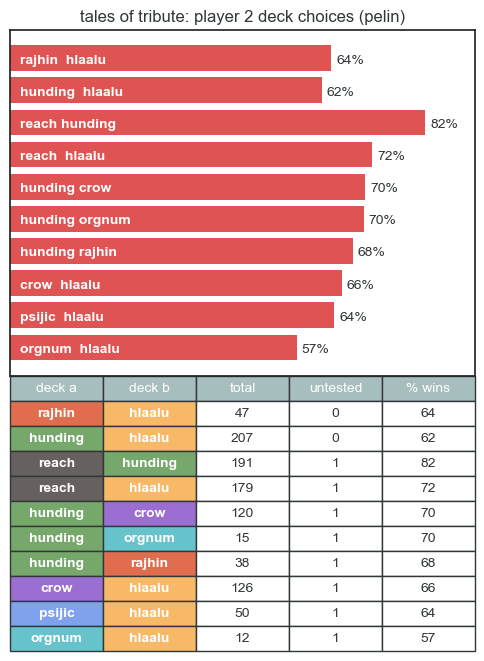
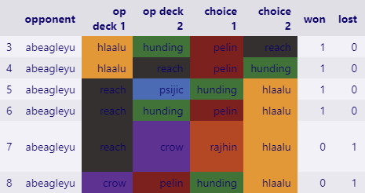

# Tales of Tribute Match Sorting & Deck Suggestions

*The Elder Scrolls Online's* __Tales of Tribute__ (ToT) is a deck-building card game added to the game with the *High Isle* Chapter. Each match starts with players taking turns choosing four decks, with thirty seconds for each choice. Player 1 chooses the first deck to start, followed by player 2 choosing the second and third decks. Player 1 then chooses the final deck. The combination of decks in a game can have a significant impact on the outcome. Most players are more comfortable with particular combinations and have an easier time winning with them, but might fail to notice if their favorites are weak when combined in specific ways. It's also important to make sure that there are multiple ways to win with the decks chosen for a match--some combinations come down to luck of the draw significantly more often than others, with fewer options for recovering once you fall behind.

----------
__Objective:__ analyze past ToT match outcomes and return information to inform deck selection at the start of future matches in a quick-to-read format.

----------

## __Setup__

### Packages required:

- jupyter notebook
- pandas
- numpy
- matplotlib

### Optional packages:
- gspread
- gspread_dataframe

Made with Python 3.10.8

## __Importing matches__

Column names need to be the same as this matches sheet: [blank Tales of Tribute log](https://docs.google.com/spreadsheets/d/1YQ2j1tEnVOCa40rRS8KYiVN84ltjJW523-lenTeBh_M/edit?usp=sharing)

### __Import with gspread:__

gspread setup:

[Enable API Access](https://docs.gspread.org/en/v5.7.0/oauth2.html#oauth-client-id)

[For Bots: Using Service Account](https://docs.gspread.org/en/v5.7.0/oauth2.html#for-bots-using-service-account)--*(Change the file name and sheet instead of creating a new python file with the code shown after step 8.)*

### __Import from a csv:__

 Replace the file name in cell 2, line 11 with your file (and file path, if it isn't in the TributeMatchSorting folder).

```
df = pd.read_csv('examplefilename.csv')
```

 To use other file formats, [search the pandas website](https://pandas.pydata.org/docs/search.html) for specific instructions.

### __Deck names__

If you used different labels for any decks, add your preferred label to the dictionary in cell 6. For example, if you use 'red eagle' for the 'Red Eagle, King of the Reach' deck instead of 'black' or 'reach', change:
```
'black':'reach',
```
in the fourth line to:

```
'red eagle':'reach',
```

If you already use the values on the right side of each line ('pelin', 'psijic', etc), you shouldn't need to change anything.

---

## Match Suggestion Examples

### __Player 1: First Deck__

With no decks entered, the returned bar graph shows how often past matches containing each deck were won to help with first deck choice as Player 1.

```
choose_deck()
```



*__Best deck choice shown:__ Saint Pelin (red)*

---

### __Player 2: Second and Third Decks__

Entering only one deck returns a bar graph with pairs of choices. Combinations with Player 1's selected deck + one of the possible remaining deck option pairs are averaged, leaving out any combinations that haven't been seen yet in a match. __Choices are ranked first by the deck pairs with the fewest untested combinations, then by the averaged win rate for each pair.__

```
choose_deck('pelin')
```



*__Best deck choice shown:__ The Reach (black) + Ansei Hunding (green)*

---

### __Player 1: Fourth Deck__

After Player 1's first deck choice and the pair of decks chosen by Player 2 are entered, the bar graph shows the win rate of matches containing the selected decks plus each of the remaining choices to help select the final deck for the match.

```
choose_deck('pelin', 'reach', 'hunding')
```


*__Best deck choice shown:__ King Orgnum (teal)*

---

### __Past matches with opponent__

If it isn't your first match playing against a specific opponent, checking the choices and results of past matches might improve your chances of winning. As Player 2, it offers a better guess for what they might choose for the fourth deck (assuming they have a clear pattern). As Player 1, it can show if you've consistently won matches against them with a slightly weaked deck combination.

```
opp_prefs("abeagleyu")
```



If 'abeagleyu' was player 2 in the above examples, player 1 might have been better off choosing __Grandmaster Hlaalu__ for the fourth deck instead of King Orgnum, since 'abeagleyu' lost every match with those four decks.