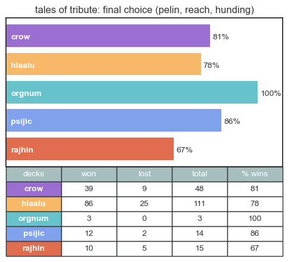

# Tales of Tribute Match Sorting & Deck Suggestions

*The Elder Scrolls Online's* __Tales of Tribute__ (ToT) is a deck-building card game added to the game with the *High Isle* Chapter. Each match starts with players taking turns choosing four decks, with thirty seconds for each choice. Player 1 chooses the first deck to start, followed by player 2 choosing the second and third decks. Player 1 then chooses the final deck. The combination of decks in a game can have a significant impact on the outcome. Most players are more comfortable with particular combinations and have an easier time winning with them, but might fail to notice if their favorites are weak when combined in specific ways. It's also important to make sure that there are multiple ways to win with the decks chosen for a match--some combinations come down to luck of the draw significantly more often than others, with fewer options for recovering once you fall behind.

---

__Objective:__ analyze past ToT match outcomes and return information to inform deck selection at the start of future matches in a quick-to-read format.

---

## __Data__

Notebook runs with mock data (*mock_tribute.csv*) generated via [Mockaroo](https://mockaroo.com/).

[Blank Google Sheets Template](https://docs.google.com/spreadsheets/d/1YQ2j1tEnVOCa40rRS8KYiVN84ltjJW523-lenTeBh_M/edit?usp=sharing) available for tracking matches. Go to File > Make a Copy to use. Sheets are set up to format cell background colors by deck name. Names and colors can be edited by selecting all columns and going to Format > Conditional Formatting.

If using another file format, make sure the column names and contents match:


### __Columns:__

- 'choice': '1' or '2' for whether you got the first or second deck choice

- 'opponent': username of opposing player *(can be left blank)*

- 'p1 first' - 'p1 second': decks chosen at the start of a match, in order of selection *(values used for each deck can be edited, see next section)*

- 'result': uses 'W' for wins, 'L' for losses, and 'C' for conceded matches; other values will be ignored in score totals *(expected 'results' values can be edited in cell 9)*

- 'notes': commentary for personal use; just avoid commas if using a csv *(can be left blank)*

### __Deck names__

To use different values for each deck in matches record, add your preferred label to the dictionary in cell 4 under '__Deck names used__'. For example, if you use 'duke' for the 'Duke of Crows' deck instead of 'purple' or 'crow', change:
```
'purple':'crow',
```
on line 9 to:

```
'duke':'crow',
```

If you already used the values on the right side of each line ('pelin', 'psijic', etc), you shouldn't need to change anything.

---

## __Setup__

### __Packages required__:

- jupyter notebook
- pandas
- numpy
- matplotlib

### __Optional__:
- gspread
- gspread_dataframe

*Made with Python 3.10.8*

### __How to run__

1. [Download .zip](https://github.com/racheldelong/TributeMatchSorting/archive/refs/heads/main.zip) or clone repository with Git:

```
git clone https://github.com/racheldelong/TributeMatchSorting.git
```


2. To [create conda environment](https://conda.io/projects/conda/en/latest/user-guide/tasks/manage-environments.html#creating-an-environment-from-an-environment-yml-file), open Anaconda Prompt, change directory to TributeMatchSorting folder and enter:

```
conda env create -f environment.yml
```

3. Activate conda environment by entering:

```
conda activate tribute
```

4. With tribute environment active, open Jupyter Notebook from Anaconda Prompt by entering:

```
jupyter notebook
```

5. Click __'tribute.ipynb'__ in the browser window to open main file.

---

## __How to use__

- Run the entire notebook with *ctrl+a* to select all, and *shift+enter* to run selected cells. 

- After setting up to use your own matches, run entire notebook again any time you want to update scores with new matches. Don't forget to save matches file before running if you aren't using Google Sheets.

- Match suggestion examples and space to use are at the bottom of the notebook.

## __Importing matches__

### __gspread setup:__

- [Enable API Access](https://docs.gspread.org/en/v5.7.0/oauth2.html#oauth-client-id)

- [For Bots: Using Service Account](https://docs.gspread.org/en/v5.7.0/oauth2.html#for-bots-using-service-account)--*(Change the file name and sheet in notebook cell 2 instead of creating a new python file with the code shown after step 8.)*

### __local file (csv, etc):__

 Replace the file name in cell 2, line 11 with your file (and file path, if it isn't in the TributeMatchSorting folder).

```
df = pd.read_csv('examplefilename.csv')
```

 To use other file formats, [search the pandas website](https://pandas.pydata.org/docs/search.html) for specific instructions.

 *Google Sheets files can be downloaded as .csv files, if you want to use Sheets to track matches but don't want to use gspread.*

---

## __Match Suggestion Examples__

*Note: match suggestions are only set up for matches against other players. In matches against NPCs, players and the NPC choose two decks for their turn whether they go first or second. NPC match suggestion options will be added soon.*

### __Player 1: First Deck__

With no decks entered, the returned bar graph shows how often past matches containing each deck were won to help with first deck choice as Player 1.

```
choose_deck()
```


*__Best deck choice shown:__ Saint Pelin (red)*

---

### __Player 2: Second and Third Decks__

Entering only one deck returns a bar graph with pairs of choices. Combinations with Player 1's selected deck + one of the possible remaining deck option pairs are averaged, leaving out any combinations that haven't been seen yet in a match. __Choices are ranked first by the deck pairs with the fewest untested combinations, then by the averaged win rate for each pair.__

```
choose_deck('pelin')
```


*__Best deck choice shown:__ The Reach (black) + Ansei Hunding (green)*

---

### __Player 1: Fourth Deck__

After Player 1's first deck choice and the pair of decks chosen by Player 2 are entered, the bar graph shows the win rate of matches containing the selected decks plus each of the remaining choices to help select the final deck for the match.

```
choose_deck('pelin', 'reach', 'hunding')
```



*__Best deck choice shown:__ King Orgnum (teal)*

---

### __Past matches with opponent__

If it isn't your first match playing against a specific opponent, checking the choices and results of past matches might improve your chances of winning. As Player 2, it offers a better guess for what they might choose for the fourth deck (assuming they have a clear pattern). As Player 1, it can show if you've consistently won matches against them with a slightly weaked deck combination.

```
opp_prefs("abeagleyu")
```


If 'abeagleyu' was player 2 in the above examples, player 1 might have been better off choosing __Grandmaster Hlaalu__ for the fourth deck instead of King Orgnum, since 'abeagleyu' lost every match with those four decks.
